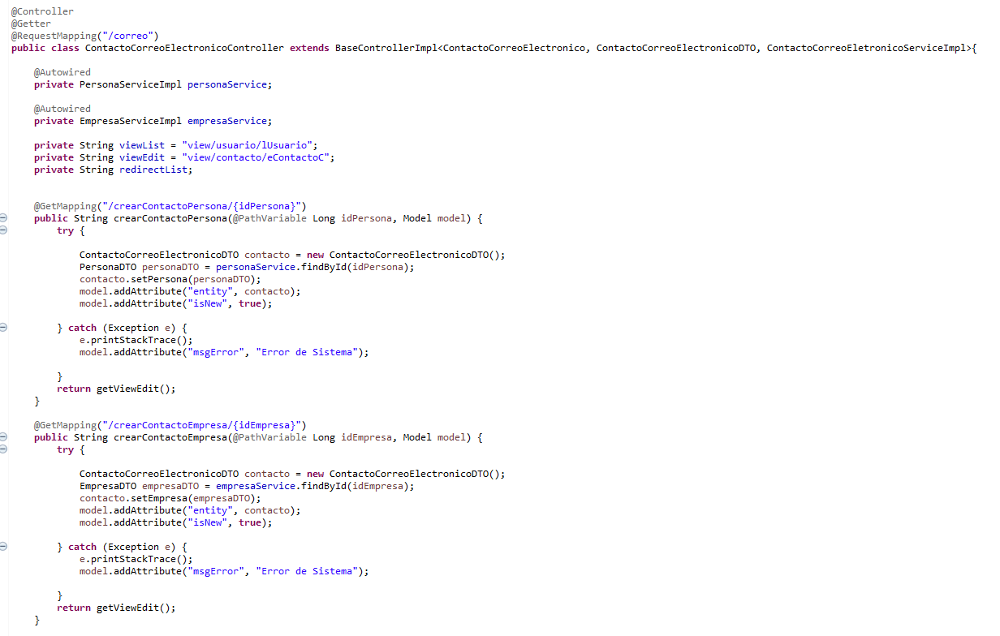

# Patrones implementados en el ejercicio 6i

---

## Patrón Creacional

### Patrón Factory

Es un patrón de creación cuyo objetivo es **desacoplar la creación de objetos de su uso**.  
En lugar de instanciar directamente una clase con `new`, delegamos la creación a una “fábrica” que decide qué tipo concreto crear.

**Ventajas:**
- Facilita cambios de implementación.
- Centraliza la creación de objetos.
- Permite trabajar con interfaces o clases abstractas sin depender de clases concretas.

**Implementación en el ejercicio:**

Lo usamos en la creación de diferentes tipos de contacto (`ContactoTelefonicoDTO` o `ContactoCorreoElectronicoDTO`).  
El método `crear` de la clase `ContactoFactory` recibe un parámetro `clase` que determina la clase del objeto `Contacto` que debe crear y devuelve la instancia correspondiente.  

Esto permite tener una clase `ContactoController` con **un único método `crear`** para cualquiera de los dos tipos de contacto, evitando repetir código en las clases especializadas (`ContactoTelefonicoController` y `ContactoCorreoElectronicoController`).  

Así, el controlador no necesita conocer las clases concretas, solo la **interfaz `ContactoDTO`** o la clase base `Contacto`.

**Antes:**  

**Después:**  

---

## Patrón de Comportamiento

Define el esqueleto de un algoritmo en una **clase base**, dejando que las subclases implementen ciertos pasos específicos.

**Ventajas:**
- Evita duplicación de código.
- Centraliza la lógica común.
- Permite flexibilidad en la implementación de pasos concretos.

**Implementación en el ejercicio:**

Usamos **Template Method** en el controlador y en los servicios, partiendo de `BaseServiceImpl` con métodos genéricos (`save`, `update`, `delete`).  
Luego, las clases concretas **sobreescriben solo algunos pasos**.  
También lo usamos en los controladores para mantener la lógica genérica centralizada.

---

## Patrón Estructural

### Patrón Facade (Fachada)

El patrón Facade proporciona una **interfaz unificada y simplificada** para un conjunto de interfaces o subsistemas complejos.  

Su objetivo es **ocultar la complejidad interna** y ofrecer al cliente un punto de acceso más fácil de usar.

**Ventajas:**
- Reduce el acoplamiento entre el cliente y los subsistemas.
- Centraliza la lógica de coordinación entre varias clases.
- Hace más legible y mantenible el código de alto nivel.

**Implementación en el ejercicio:**

Lo usamos para **centralizar la lógica del método que permite ver el detalle de un contacto**.  
Al tener diferentes clases que heredan de `Contacto`, este patrón facilita tener un **único método** que resuelva el detalle dependiendo de la clase, permitiendo agregar otros tipos de contacto sin tener que definir un método especializado para cada clase.
