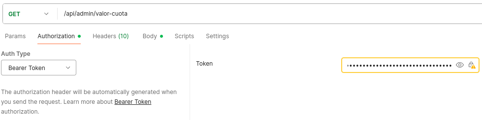
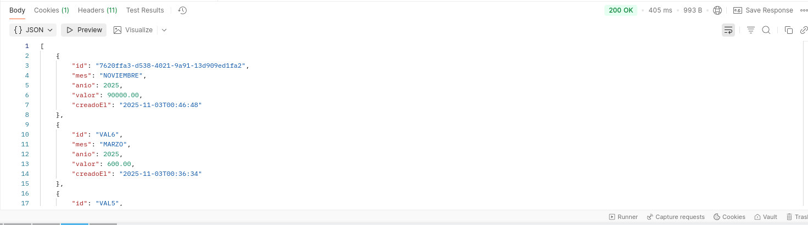
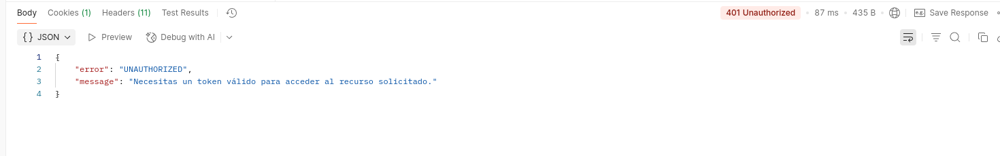
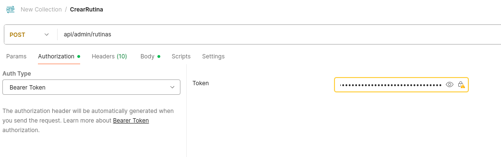
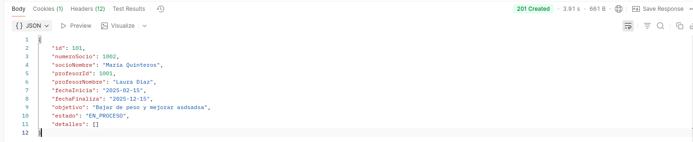

# Api Rest
Spring security: ademas del manejo de session e cifrado de contraseña, se incorporo una api rest con las mismas funcionalidades que tiene la web, pero comunicandose por JWT


## Ejemplo Uso

### Logearse y obtener un access token (JWT)
endpoint -> /api/auth/login
```Json
{
  "username": "admin",
  "password": "admin123"
}
```
ejemplo response 
```
{
    "accessToken": "token",
    "refreshToken": "token",
    "tokenType": "Bearer"
}
```

### Ejemplo de uso para consultar los valores de la cuota mensual

endpoint -> /api/admin/valor-cuota



ejemplo response con autorizacion:


ejemplo sin autorizacion (sin token o token invalido)




### Crear rutina

usar el token ya seas de admin o profesor.

ajustar el endpoint -> api/admin/rutinas

ejemplo de json
```
{
  "numeroSocio": 1002,
  "profesorId": 1001,
  "fechaInicia": "2025-02-15",
  "fechaFinaliza": "2025-12-15",
  "objetivo": "Bajar de peso y mejorar asdsadsa"
}
```



## Lista de endpoints de la API

### Mensajes (`ADMIN` u `OPERADOR`)

| Método     | Endpoint                              | Descripción                                                                            |
| ---------- | ------------------------------------- | -------------------------------------------------------------------------------------- |
| **GET**    | `/api/mensajes?page=0&size=5`         | Listar mensajes paginados.                                                             |
| **POST**   | `/api/mensajes`                       | Crear un nuevo mensaje con un `MensajeFormDTO` válido (por ejemplo, tipo `PROMOCION`). |
| **PUT**    | `/api/mensajes/{id}`                  | Editar un mensaje existente.                                                           |
| **POST**   | `/api/mensajes/{id}/envio-masivo`     | Disparar envío masivo usando los comandos existentes.                                  |
| **POST**   | `/api/mensajes/{id}/envio-individual` | Disparar envío individual.                                                             |
| **DELETE** | `/api/mensajes/{id}`                  | Realizar borrado lógico del mensaje.                                                   |

---

### Socios (`solo ADMIN`)

| Método     | Endpoint                 | Descripción                                                                                    |
| ---------- | ------------------------ | ---------------------------------------------------------------------------------------------- |
| **GET**    | `/api/admin/socios?q=`   | Buscar socios de forma paginada.                                                               |
| **POST**   | `/api/admin/socios`      | Crear un nuevo socio con un `SocioFormDTO` completo (usar IDs reales de localidad y sucursal). |
| **PUT**    | `/api/admin/socios/{id}` | Actualizar un socio existente.                                                                 |
| **DELETE** | `/api/admin/socios/{id}` | Eliminar (borrado lógico) un socio.                                                            |

---

### Empleados (`solo ADMIN`)

| Método    | Endpoint                             | Descripción                                                                        |
| --------- | ------------------------------------ | ---------------------------------------------------------------------------------- |
| **GET**   | `/api/admin/empleados?tipo=PROFESOR` | Filtrar empleados por tipo.                                                        |
| **POST**  | `/api/admin/empleados`               | Crear un empleado con `EmpleadoFormDTO` (incluir tipo, rol, dirección y sucursal). |
| **PATCH** | `/api/admin/empleados/{id}/estado`   | Activar o desactivar un empleado enviando: <br>`json {"activo": false} `           |

---

### Empresas y Sucursales (`solo ADMIN`)

| Método   | Endpoint                        | Descripción                                     |
| -------- | ------------------------------- | ----------------------------------------------- |
| **GET**  | `/api/admin/empresas`           | Listar empresas.                                |
| **POST** | `/api/admin/empresas`           | Crear una nueva empresa con `EmpresaFormDTO`.   |
| **GET**  | `/api/admin/sucursales`         | Listar sucursales.                              |
| **GET**  | `/api/admin/sucursales/activas` | Listar sucursales activas.                      |
| **POST** | `/api/admin/sucursales`         | Crear una nueva sucursal con `SucursalFormDTO`. |

---

### Valor de Cuota (`ADMIN` u `OPERADOR`)

| Método   | Endpoint                 | Descripción                                                               |
| -------- | ------------------------ | ------------------------------------------------------------------------- |
| **GET**  | `/api/admin/valor-cuota` | Consultar valores de cuota vigentes.                                      |
| **POST** | `/api/admin/valor-cuota` | Cargar un nuevo valor de cuota con `ValorCuotaFormDTO` (mes, año, valor). |

---

### Facturas (`ADMIN` u `OPERADOR`)

| Método   | Endpoint                                             | Descripción                                                                                                |
| -------- | ---------------------------------------------------- | ---------------------------------------------------------------------------------------------------------- |
| **GET**  | `/api/admin/facturas?estado=PENDIENTE`               | Listar facturas filtradas por estado.                                                                      |
| **GET**  | `/api/admin/facturas/cuotas-pendientes?socioId=<id>` | Obtener cuotas pendientes de facturación para un socio.                                                    |
| **POST** | `/api/admin/facturas`                                | Emitir una factura con `EmisionFacturaCommand` (socio, lista de cuotas, forma de pago si se marca pagada). |
| **POST** | `/api/admin/facturas/{id}/confirmar`                 | Confirmar y registrar un pago con `PagoCommand`.                                                           |
| **POST** | `/api/admin/facturas/{id}/anular`                    | Anular una factura con: <br>`json {"observacion": "motivo"} `                                              |

---

### Rutinas (`ADMIN` o `PROFESOR`)

| Método    | Endpoint                                                  | Descripción                                                                             |
| --------- | --------------------------------------------------------- | --------------------------------------------------------------------------------------- |
| **GET**   | `/api/admin/rutinas/actual?numeroSocio=<nro>`             | Consultar la rutina vigente de un socio.                                                |
| **GET**   | `/api/admin/rutinas/finalizadas?profesorId=<id>`          | Ver el historial de rutinas finalizadas por profesor.                                   |
| **POST**  | `/api/admin/rutinas`                                      | Crear una rutina con `RutinaCreateRequest` (numeroSocio, profesorId, fechas, objetivo). |
| **PATCH** | `/api/admin/rutinas/{id}/estado`                          | Cambiar estado de rutina, por ejemplo: <br>`json {"estado": "FINALIZADA"} `             |
| **POST**  | `/api/admin/rutinas/{id}/detalles`                        | Agregar un día a la rutina con: <br>`json {"diaSemana": "LUNES"} `                      |
| **POST**  | `/api/admin/rutinas/{id}/detalles/{detalleId}/ejercicios` | Añadir ejercicios a un día de la rutina.                                                |

---